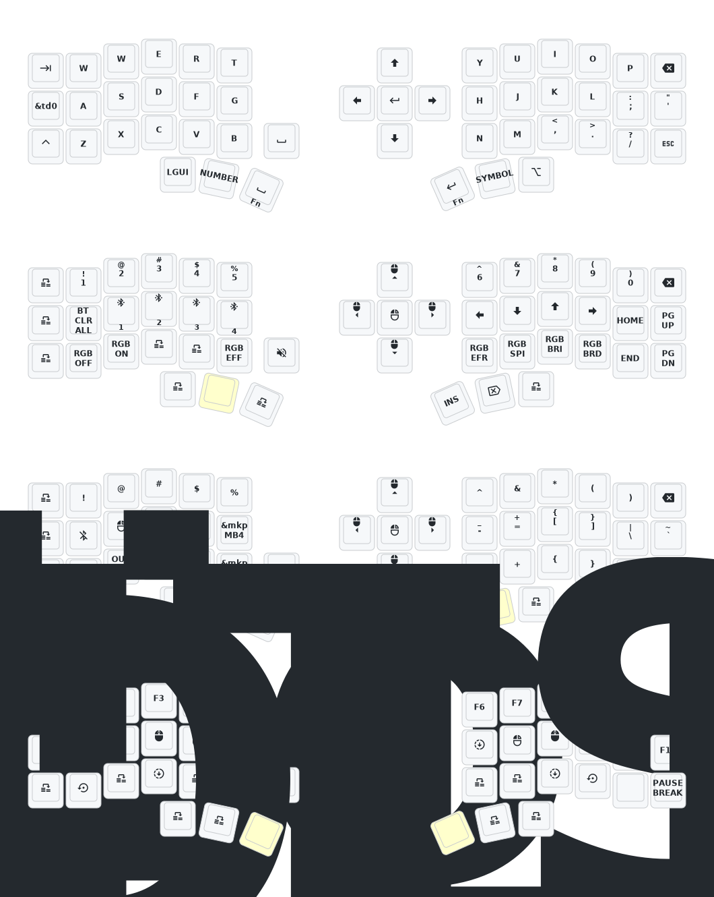

# Corne Bluetooth無線分割キーボード　ZMK

## 使用方法

1. [このレポジトリをフォークします](https://docs.github.com/en/get-started/quickstart/fork-a-repo#forking-a-repository)。
2. [Actionタブを押して、ワークフローを有効化させます](https://docs.github.com/en/actions/managing-workflow-runs-and-deployments/managing-workflow-runs/disabling-and-enabling-a-workflow#enabling-a-workflow)。
3. [`config/west.yml`](config/west.yml) 内の `eyelash_corne` プロジェクトがまだ有効であることを確認してください。この URL から `boards/arm/eyelash_corne` フォルダがダウンロードされます。
4. フォーク内に `boards/arm/eyelash_corne` フォルダがまだ存在する場合は、削除します。

## Corneのデフォルトキーマップ

